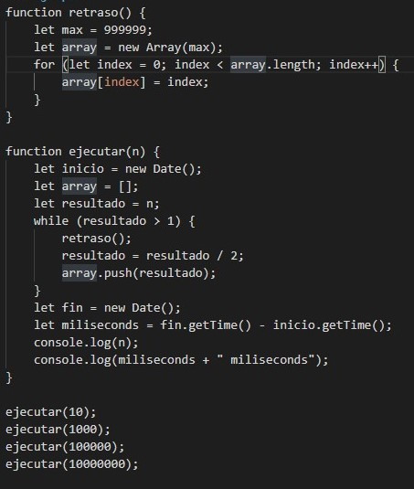
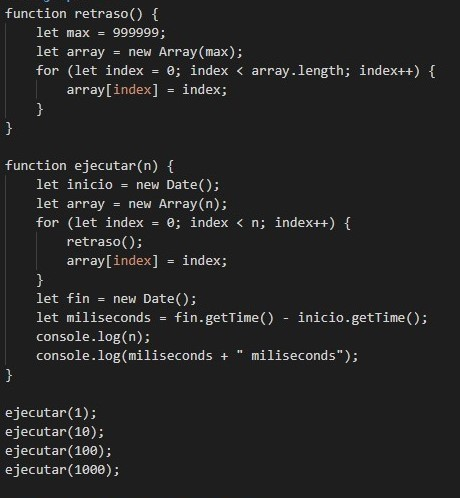
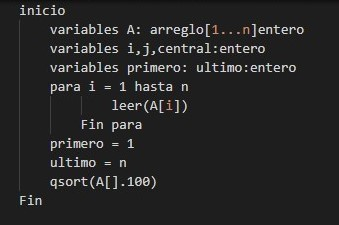
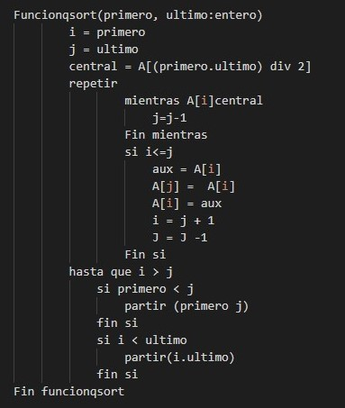
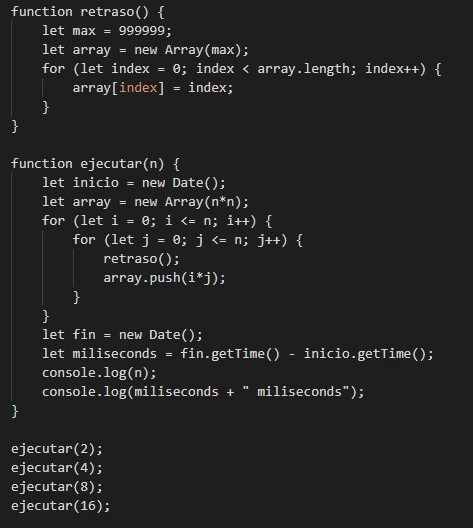

# ComplejidadComputacional

## Algoritmo de orden constante 
Cuando las instrucciones se ejecutan una vez.

## Algoritmo de orden logaritmico
Esta suele aparecer en determinados algoritmos con iteración o recursión no estructural, ejemplo la búsqueda binaria.

### Ejemplo

## Algoritmo de orden lineal 
Es una complejidad buena y también muy usual. Aparece en la evaluación de bucles simples siempre que la complejidad de las instrucciones interiores sea constante.

### Ejemplo 

## Algoritmo de orden cuasi-lineal 
Se encuentra en algoritmos de tipo divide y vencerás como por ejemplo en el método de ordenación quicksort y se considera una buena complejidad. Si n se duplica, el tiempo de ejecución es ligeramente mayor del doble.

### Ejemplo
 
                        

## Algoritmo de orden cuadrática
Aparece en bucles o ciclos doblemente anidados. Si n se duplica, el tiempo de ejecución aumenta cuatro veces.

### Ejemplo 

## Algoritmo de orden polinomica
Si a crece, la complejidad del programa es bastante mala.

## Algoritmo de orden exponencial
No suelen ser muy útiles en la práctica por el elevadísimo tiempo de ejecución. Se dan en subprogramas recursivos que contengan dos o más llamadas internas. N

## Algoritmo de orden Factorial
Prueva todas las combinaciones posibles 